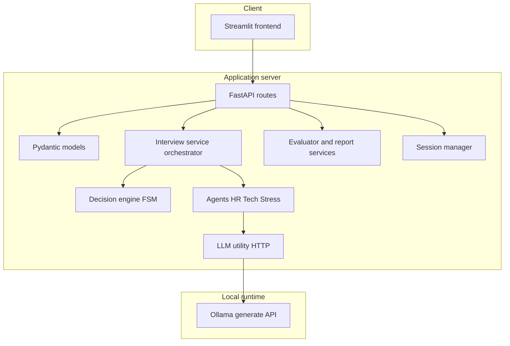

# ReflectInterview (ReflectAI — Inside Your Interview Brain)

**Repository:** [https://github.com/BlackBeanEagles/ReflectAI-Inside-Your-Interview-Brain](https://github.com/BlackBeanEagles/ReflectAI-Inside-Your-Interview-Brain)

---

## Project title and overview

### Title

**ReflectInterview** — an AI-assisted mock interview system that simulates multi-round interviews (HR, technical, and stress), scores answers, adapts difficulty, and produces structured feedback and session reports. The codebase is published as **ReflectAI — Inside Your Interview Brain** on GitHub.

### Problem

Job candidates often get limited, expensive, or inconsistent interview practice. Traditional mock interviews depend on another person’s time, do not scale, and rarely provide immediate, dimension-by-dimension feedback across behavioral, technical, and high-pressure scenarios. Many learners also want to practice **without sending résumés or answers to a third-party cloud** every time.

### Proposed solution

This project delivers a **local-first** practice loop:

1. **Structured pipeline** — résumé text or PDF is parsed and cleaned; questions are generated in rounds that mirror real interviews.
2. **Session memory** — each run has a `session_id`; interactions (question, answer, scores, feedback) are stored server-side for history and final reporting.
3. **LLM-backed generation and judging** — [Ollama](https://ollama.com/) runs a local model (default **Llama 3** via HTTP); prompts live in dedicated **agent** and **evaluator** modules so the API stays thin.
4. **Adaptive flow** — a **decision engine** moves the candidate among HR, technical, and stress rounds using score history, caps on total questions, and difficulty nudges (including optional cognitive-style hints in later weeks of the build).

Together, this gives repeatable, private practice with tangible scores and narrative feedback.

---

## Functional demonstration

Follow these steps to demonstrate the system end-to-end.

### 1. Environment

- Install **Python 3.12+** and **Ollama**.
- Pull the model expected by the backend (default in `utils/llm.py`):

  ```bash
  ollama pull llama3
  ```

- Create a venv and install dependencies from the project root:

  ```bash
  python -m venv venv
  .\venv\Scripts\activate
  pip install -r requirements.txt
  ```

### 2. Start Ollama

Run the Ollama server (GPU or CPU scripts in the repo, or `ollama serve`). Confirm the API is reachable at `http://localhost:11434`.

### 3. Start the backend

```bash
uvicorn app.main:app --reload
```

Confirm `GET http://127.0.0.1:8000/` returns `{"message":"API running"}`.

### 4. Start the frontend

```bash
streamlit run frontend/app.py
```

Open the URL shown in the terminal (typically `http://localhost:8501`).

### 5. What to demonstrate in the UI

| Area | What to show |
|------|----------------|
| **Interview session** | Start or continue a session: HR-style questions first, then technical questions grounded in parsed résumé data; optional stress round when scores trigger it; per-answer evaluation with scores and feedback; session capped so the loop cannot run forever. |
| **Résumé analysis** | Upload or paste a résumé: structured extraction, cleaned fields, and a one-off technical question plus evaluation path aligned with the API. |
| **Evaluation** | Submit an answer and show multi-dimensional scores (dimensions differ for HR vs technical) and structured strength / weakness / improvement text. |
| **Report** | After several interactions, generate a **session report** (via session endpoints used by the UI) summarizing performance. |
| **Week 5 extras** | If enabled in the flow, **replay compare** and cognitive-style reporting are exposed through session/report services (see API section below). |

### 6. Automated checks

```bash
pip install -r requirements-dev.txt
pytest
```

Optional subprocess smoke test for the Ollama CLI (independent of the HTTP client the app uses):

```bash
python test_llm.py
```

---

## Documentation

### Architecture at a glance



### Approach

- **Separation of concerns:** Route modules (`api/routes/`) validate input and delegate. **Business logic** lives in `services/` and `agents/`. The LLM is accessed through `utils/llm.py` so the model and transport can change without rewriting routes.
- **Single orchestration entry for interview steps:** `services/interview_service.py` (`run_interview_step`) wires résumé processing, cleaning, round detection, agent selection, and error handling for LLM failures.
- **Explicit state machine for rounds:** `services/decision_engine.py` decides the next round (`hr`, `technical`, `stress`, `end`), difficulty transitions, and stress limits from **score history** and configuration (e.g. max questions, stress bounds). This keeps “what happens next” testable and readable.
- **Sessions as the source of truth for a run:** `services/session_manager.py` backs endpoints under `/session` so the UI can create a session, append evaluated interactions, fetch history, reset, and request reports.

### Implementation map

| Layer | Responsibility | Key files |
|-------|----------------|-----------|
| **HTTP API** | REST endpoints, no prompt engineering | `app/main.py`, `api/routes/interview.py`, `resume.py`, `evaluation.py`, `session.py` |
| **Validation** | Request/response contracts | `models/schemas.py` |
| **Orchestration** | One step of the interview pipeline | `services/interview_service.py` |
| **Flow control** | HR → technical → stress → end | `services/decision_engine.py`, `services/adaptive_engine.py` |
| **Agents** | HR, technical, stress question text | `agents/hr_agent.py`, `agents/technical_agent.py`, `agents/stress_agent.py` |
| **Résumé** | PDF/text processing and cleaning | `services/resume_processor.py`, `services/pdf_parser.py`, `services/data_cleaner.py`, `services/resume_parser.py` |
| **Evaluation** | Rubric-based scoring and feedback | `services/evaluator.py`, `services/evaluation_logic.py` |
| **Reports and replay** | Final report and answer comparison | `services/report_generator.py`, `services/replay_learning.py` |
| **Cognitive extensions** | Optional nudges and pipeline hooks | `services/cognitive_pipeline.py`, related session/report paths |
| **LLM** | Ollama HTTP `POST /api/generate` | `utils/llm.py` |
| **UI** | Tabs, session UX, calls to backend | `frontend/app.py` |

### Main API surface (for integrators)

| Method | Path | Role |
|--------|------|------|
| POST | `/start-interview` | Standalone HR question from provided context |
| POST | `/parse-resume` | Parse text or uploaded PDF into structured + cleaned data |
| POST | `/technical-question` | Technical question from cleaned résumé data |
| POST | `/next-question` | Stateful next step (orchestrated flow, rounds, difficulty) |
| POST | `/evaluate-answer` | Multi-dimensional evaluation + feedback |
| POST | `/session/start` | Create `session_id` |
| POST | `/session/add-interaction` | Append one evaluated turn |
| GET | `/session/{session_id}` | Full session history |
| DELETE | `/session/{session_id}/reset` | Clear session |
| POST | `/session/{session_id}/report` | Generate report |
| POST | `/session/replay-compare` | Compare answer versions (Week 5) |

CORS in `app/main.py` allows the Streamlit origin on `localhost` / `127.0.0.1` port **8501**.

### Prerequisites and run commands (summary)

- **Ollama** + model aligned with `utils/llm.py` (`MODEL`, e.g. `llama3:latest`).
- Backend: `uvicorn app.main:app --reload`
- Frontend: `streamlit run frontend/app.py`
- Tests: `pytest` (see `pytest.ini`)

---

## Use case and impact

### Real-world applications

- **Individual job seekers** — Practice behavioral and technical questions **before** high-stakes interviews; iterate on answers using concrete scores and feedback.
- **Bootcamps and career services** — Offer many students more “interview reps” without proportional staff time; instructors can review session reports offline.
- **Teams and privacy-conscious orgs** — With Ollama running **on-device or on-premises**, practice data can stay off public SaaS if policy requires it.
- **Product and engineering demos** — Shows a full small stack: FastAPI + Streamlit + local LLM + session persistence patterns suitable for extensions (auth, DB, cloud model routing).

### Potential impact

- **Accessibility** — Low marginal cost per session compared to human-only mocks.
- **Consistency** — Every answer is scored with the same rubric dimensions for a given round type.
- **Transparency** — Architecture is modular: schools and teams can swap models, swap storage, or add databases without rewriting the entire UI.
- **Safety net** — Bounded question counts and explicit `end` state reduce runaway generation loops in long sessions.

---

## Project layout (quick reference)

| Path | Role |
|------|------|
| `app/main.py` | FastAPI app, CORS, router registration |
| `api/routes/` | HTTP routes |
| `agents/` | HR, technical, stress agents |
| `services/` | Orchestration, parsing, evaluation, reports, adaptive engine |
| `models/` | Pydantic schemas |
| `utils/llm.py` | Ollama HTTP client |
| `frontend/app.py` | Streamlit UI |
| `tests/` | Pytest suite |

---

## License

Add a `LICENSE` file if you distribute this repository; none is included by default.
