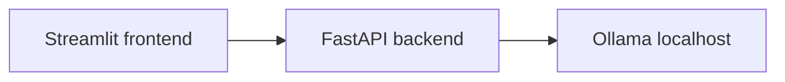

# ReflectInterview

AI mock interview platform: a **FastAPI** backend drives HR, technical, and stress interview rounds with **Ollama** (local LLM), and a **Streamlit** UI runs the session, resume analysis, evaluation, and reports.

## Features

- Stateful interview flow (HR → technical → stress) with session memory
- Resume upload and parsing (PDF), technical questions tailored to extracted skills
- Per-answer evaluation, adaptive flow, and final report generation
- Cognitive-style signals and replay comparison (see service modules under `services/`)

## Prerequisites

- **Python 3.12+** (project uses 3.12 in local tooling)
- **[Ollama](https://ollama.com/)** installed and on your `PATH`
- A pulled model matching the backend default, e.g.:

  ```bash
  ollama pull llama3
  ```

  The HTTP client uses the model name configured in `utils/llm.py` (`MODEL`, default `llama3:latest`). Change it there if you use another tag.

## Setup

```bash
cd reflect_inter
python -m venv venv

# Windows
.\venv\Scripts\activate

pip install -r requirements.txt
```

For tests and HTTP client utilities:

```bash
pip install -r requirements-dev.txt
```

## Run Ollama

The API talks to Ollama at `http://localhost:11434` (see `utils/llm.py`).

- **GPU (Windows, CUDA):** `start_ollama.bat` — logs to `ollama_debug.log` in the project folder.
- **CPU:** `start_ollama_cpu.bat` (or run `ollama serve` in a terminal).

Leave Ollama running while you use the app.

## Run the application

**1. Backend** (from project root):

```bash
uvicorn app.main:app --reload
```

Default API: `http://127.0.0.1:8000` — root `GET /` returns `{"message":"API running"}`.

**2. Frontend** (second terminal, same venv):

```bash
streamlit run frontend/app.py
```

Open the URL Streamlit prints (typically `http://localhost:8501`). CORS on the API allows that origin.

## Tests

```bash
pytest
```

Configuration: `pytest.ini` (`testpaths = tests`).

## Optional: quick LLM smoke test

`test_llm.py` runs `ollama run llama3` via subprocess (separate from the HTTP path the app uses). Useful to verify the CLI and model:

```bash
python test_llm.py
```

## Project layout

| Path | Role |
|------|------|
| `app/main.py` | FastAPI app, CORS, router registration |
| `api/routes/` | HTTP routes: interview, resume, evaluation, session |
| `agents/` | HR, technical, stress agent logic |
| `services/` | Interview orchestration, parsing, evaluation, reports, adaptive engine |
| `models/` | Pydantic schemas |
| `utils/llm.py` | Ollama HTTP `generate` client |
| `frontend/app.py` | Streamlit UI |
| `tests/` | Pytest suite |

## Architecture (high level)



## License

Add a `LICENSE` file if you distribute this repo; none is assumed here.
