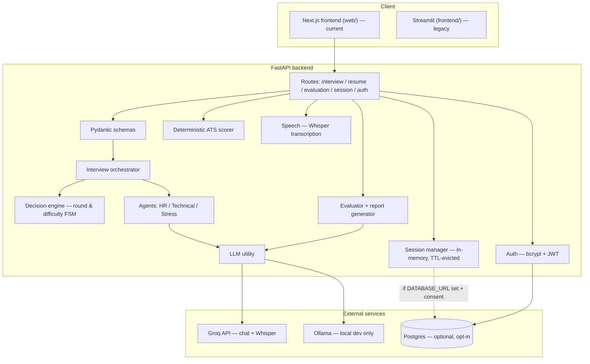

# ReflectInterview (ReflectAI — Inside Your Interview Brain)

**Live app:** [reflect-ai-inside-your-interview-br.vercel.app](https://reflect-ai-inside-your-interview-br.vercel.app) · **API:** [reflectinterview-api.onrender.com](https://reflectinterview-api.onrender.com/health)
**Older Streamlit build** (still deployed, no longer developed): [reflectinterview.streamlit.app](https://reflectinterview.streamlit.app)
**Repository:** [github.com/BlackBeanEagles/ReflectAI-Inside-Your-Interview-Brain](https://github.com/BlackBeanEagles/ReflectAI-Inside-Your-Interview-Brain)

> Free-tier hosting note: the backend spins down after ~15 minutes idle and the frontend sleeps similarly — the first request after a quiet period can take 30–50 seconds to wake up. That's the hosting tier, not a bug.

---

## What this is

An AI-powered mock interview platform that runs full multi-round interviews (HR → Technical → Stress), scores every answer across multiple dimensions, adapts difficulty from real-time performance, and — separately — a **deterministic ATS resume scorer** that mirrors how real applicant-tracking systems actually filter candidates, not an LLM guessing a number.

**Core capabilities:**

- **Adaptive multi-round interviews** — a decision engine moves the candidate through HR, Technical, and (triggered on a performance dip) Stress rounds, adjusting difficulty from score history.
- **Résumé intelligence** — PDF or pasted text is parsed into structured skills/projects/experience and used to generate résumé-grounded technical questions.
- **Multi-dimensional evaluation** — every answer is scored on several rubric dimensions (varies by round) with structured strength/weakness/improvement feedback.
- **Voice input/output** — record an answer instead of typing (transcribed via Groq's Whisper API) and have the question read aloud (browser-native text-to-speech, zero backend cost).
- **Deterministic ATS scoring** — a 7-category weighted model (Keyword Match, Experience Relevance, ATS Formatting, Skills Section, Education & Certifications, Contact Information, Grammar & Readability) that scores a résumé against a specific job description. No LLM in the scoring path — the same résumé + job description always produce the same score, and every point traces back to a specific matched keyword or check. Includes a **Resume ROI** improvement plan ranked by exact expected score gain, keyword importance visualization, and section-by-section ranking.
- **Optional user accounts** — email/password signup with JWT sessions; logged-in users can (with explicit consent) have their résumé and interview history persist across visits.
- **Session reports** — after a session, generate a structured report: overall/round scores, detected patterns, strengths/weaknesses, and a cognitive-profile block (thinking style, consistency, impulsivity signals).

---

## Architecture


```mermaid
flowchart TB
  subgraph client [Client]
    FE["Next.js frontend (web/) — current"]
    FE2["Streamlit (frontend/) — legacy"]
  end
  subgraph server [FastAPI backend]
    API[Routes: interview / resume / evaluation / session / auth]
    VAL[Pydantic schemas]
    ORCH[Interview orchestrator]
    DEC[Decision engine — round & difficulty FSM]
    AG[Agents: HR / Technical / Stress]
    EV[Evaluator + report generator]
    ATS[Deterministic ATS scorer]
    SESS[Session manager — in-memory, TTL-evicted]
    AUTH[Auth — bcrypt + JWT]
    SPEECH[Speech — Whisper transcription]
    API --> VAL --> ORCH
    API --> EV
    API --> SESS
    API --> ATS
    API --> AUTH
    API --> SPEECH
    ORCH --> DEC
    ORCH --> AG
    AG --> LLMUTIL[LLM utility]
    EV --> LLMUTIL
  end
  subgraph external [External services]
    GROQ[Groq API — chat + Whisper]
    OLL[Ollama — local dev only]
    PG[(Postgres — optional, opt-in)]
  end
  FE --> API
  LLMUTIL --> GROQ
  LLMUTIL --> OLL
  SESS -. "if DATABASE_URL set + consent" .-> PG
  AUTH --> PG
```

**Design principles that shaped this codebase:**

- **Separation of concerns.** Route modules (`api/routes/`) validate and delegate; business logic lives in `services/` and `agents/`; the LLM is accessed only through `utils/llm.py`, so swapping providers never touches route code.
- **Deterministic where it matters.** The ATS scorer computes a real score from real keyword/structure checks — never an LLM asked to "rate this resume." The one LLM-generated piece in that feature (an optional "recruiter's first read") is explicitly labeled as subjective and kept out of the numeric score.
- **Graceful degradation, not silent failure.** A slow/unreachable database, a missing `GROQ_API_KEY`, an LLM outage, an invalid voice recording, or a bad auth token all degrade to a clear error or a documented fallback — never a hang or a crash. (One real example: an earlier version of the DB connection pool had no timeout and could hang a request for 30s on a sleeping database — found via direct testing and fixed to a 3s bound.)
- **Everything optional stays optional.** Voice input, accounts, and persistent storage are all additive — the core interview and ATS-scoring flows work with zero configuration beyond an LLM provider.

---

## Running it locally

### 1. Environment

```bash
python -m venv venv
.\venv\Scripts\activate      # or: source venv/bin/activate
pip install -r requirements.txt
cp .env.example .env         # then edit .env — see below
```

### 2. Pick an LLM provider

- **Local dev (default):** install [Ollama](https://ollama.com/), `ollama pull llama3`, then `LLM_PROVIDER=ollama` in `.env`.
- **No GPU / free hosting:** get a free key at [console.groq.com](https://console.groq.com), set `LLM_PROVIDER=groq` and `GROQ_API_KEY=...`. This is what the live deployment uses. Voice transcription always uses Groq's Whisper API regardless of this setting (Ollama has no audio model).

See `.env.example` for every configurable variable (rate limits, upload caps, session TTL, optional Postgres persistence, optional JWT auth secret).

### 3. Run the backend and frontend

```bash
uvicorn app.main:app --reload      # backend  — http://127.0.0.1:8000
cd web && npm install && npm run dev   # frontend — http://localhost:3000
```

`web/` (Next.js) is the current frontend and the one that is deployed; see
[`web/README.md`](web/README.md) for its own setup and `DEPLOY.md` for
hosting it.

The original Streamlit app is still in `frontend/app.py` and still runs
(`streamlit run frontend/app.py`, http://localhost:8501), but it is no
longer being developed — none of the interface work since August has been
applied to it, so the two look nothing alike.

Confirm the backend is healthy: `GET http://127.0.0.1:8000/health`.

### 4. Tests

```bash
pip install -r requirements-dev.txt
pytest
```

~65 tests across decision-engine logic, in-process API flows, report generation, the ATS scorer (determinism, weighted categories, regression tests for real bugs found during development), and auth (hashing/JWT unit tests + full signup/login/history HTTP flow with the database mocked).

---

## Deploying your own copy for free

See **[DEPLOY.md](DEPLOY.md)** for the full walkthrough: Render (backend, Docker) + Vercel (the `web/` frontend) + Groq (LLM/Whisper), all on free tiers, plus the optional Neon Postgres setup for persistence/accounts. See **[PRIVACY.md](PRIVACY.md)** for exactly what gets stored when persistence is enabled, and what you're responsible for before pointing real users at it.

---

## API surface

| Method | Path | Role |
|--------|------|------|
| GET | `/health` | Backend + LLM + storage status |
| POST | `/parse-resume` | Parse text or PDF into structured + cleaned résumé data |
| POST | `/ats-score` | Score a résumé against a job description (7 weighted categories, ROI plan) |
| POST | `/technical-question` | Résumé-grounded technical question |
| POST | `/stress-question` | Rapid-fire stress-round question |
| POST | `/next-question` | Stateful orchestrated interview step (rounds, difficulty, cognitive hints) |
| POST | `/decide-next` | Decision engine only, no LLM call (debugging/testing) |
| POST | `/evaluate-answer` | Multi-dimensional answer evaluation + feedback |
| POST | `/transcribe-audio` | Voice answer → text (Groq Whisper) |
| POST | `/session/start` | Create a session (optionally linked to a logged-in user) |
| POST | `/session/add-interaction` | Store one evaluated turn |
| GET | `/session/{id}` | Full session history |
| DELETE | `/session/{id}/reset` | Clear a session |
| POST | `/session/{id}/report` | Generate the final report |
| POST | `/session/replay-compare` | Re-score a revised answer vs. the original |
| POST | `/auth/signup` | Create an account (requires `DATABASE_URL`) |
| POST | `/auth/login` | Exchange credentials for a JWT |
| GET | `/auth/me` | Current user from the Authorization header |
| GET | `/auth/history` | Past reports for the logged-in user |

CORS is configured via `ALLOWED_ORIGINS` / `ALLOWED_ORIGIN_REGEX` in `.env.example`.

---

## Project layout

| Path | Role |
|------|------|
| `app/main.py` | FastAPI app, CORS, rate limiting, router registration, lifespan startup |
| `api/routes/` | HTTP routes — `interview`, `resume` (incl. ATS scoring), `evaluation` (incl. transcription), `session`, `auth` |
| `agents/` | HR, Technical, Stress question-generation agents |
| `services/` | Orchestration (`interview_service`), flow control (`decision_engine`, `adaptive_engine`), résumé pipeline (`resume_processor`, `pdf_parser`, `resume_parser`, `data_cleaner`), evaluation (`evaluator`, `evaluation_logic`), reporting (`report_generator`, `replay_learning`, `cognitive_pipeline`), **`ats_scorer`** (deterministic scoring), **`db`** (optional Postgres persistence), **`auth`** (bcrypt + JWT), **`speech`** (Whisper transcription), `session_manager` (in-memory sessions) |
| `models/schemas.py` | All Pydantic request/response contracts |
| `utils/llm.py` | Ollama/Groq HTTP client, generation profiles, warm-up |
| `web/` | **Next.js frontend (current).** App Router, TypeScript, Tailwind. One route per feature; `lib/api.ts` is one typed function per backend endpoint |
| `frontend/app.py` | Streamlit UI — the original frontend, still runnable, no longer developed |
| `tests/` | Pytest suite |
| `DEPLOY.md` / `PRIVACY.md` | Free-tier deployment guide and data-handling documentation |

---

## Known limitations (documented, not hidden)

- **Session state is in-memory, single-process.** It works correctly on a single Render instance but doesn't survive a restart and wouldn't work correctly across multiple instances — a shared store (Redis) would be needed to scale past one process.
- **No LLM provider fallback.** If Groq has an outage, generation-dependent endpoints degrade to a clear error, not a fallback provider.
- **Grammar & Readability (ATS scorer)** uses heuristic proxies (bullet consistency, verb-tense consistency, repeated-word detection) rather than a real grammar-checking library — which is exactly why it's the lowest-weighted category (3%).
- **Synonym table (ATS scorer)** is a curated common-alias list, not a licensed skills taxonomy — it won't catch every equivalent term.
- **No CI pipeline yet** — tests run locally/manually, not automatically on push.
- **Password reset email only reaches the Resend account owner.** Without a verified sending domain, Resend's sandbox sender (`onboarding@resend.dev`) delivers only to the address that owns the Resend account. `/auth/forgot-password` still returns its generic success message either way — by design, so it can't be used to enumerate registered emails — so a failed send is only visible in the server logs. Verifying a domain in Resend and setting `RESEND_FROM_EMAIL` fixes it.
- **No account deletion.** There is no endpoint or UI to delete an account and its stored data; removal is a manual database operation. This also blocks a Google Play listing, which requires an in-app deletion path plus a public web URL for it.
- **Two frontends, one maintained.** `frontend/app.py` (Streamlit) and `web/` (Next.js) both talk to the same API. Only `web/` is being developed. Nothing keeps them in sync, so the Streamlit app will drift further behind.

---

## License

Add a `LICENSE` file if you distribute this repository; none is included by default.
